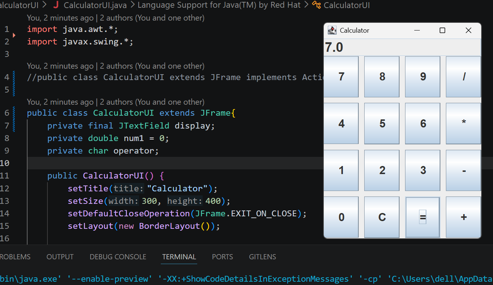
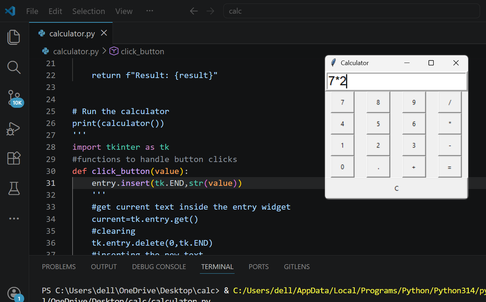

This is a basic calculator built in Java and Python each. It supports addition, subtraction, multiplication, and division.

links to the code 

- [calculator-java](CalculatorUI.java)
- [calculator-python](calculator.py)

Here’s what my calculator looks like:
In java:

In python:

